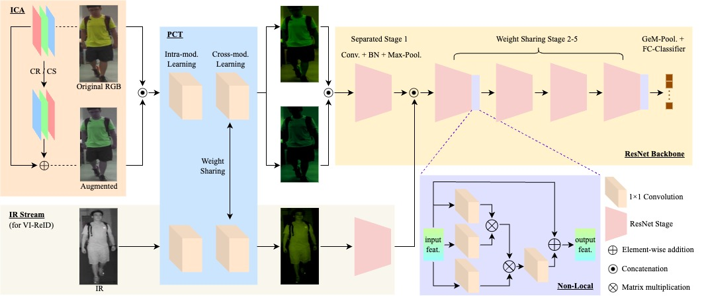

# [ICME 2024 (Oral)] Color Space Learning for Cross-Color Person Re-identification

The official implementation of "Color Space Learning for Cross-Color Person Re-identification".

More detailed information is in the [PAPER]().

 Authors: [Jiahao Nie](https://scholar.google.com/citations?user=LGM10RQAAAAJ&hl=zh-CN&inst=8669986779262753491&oi=ao), [Shan Lin](https://scholar.google.com/citations?user=3MQDywkAAAAJ&hl=zh-CN&inst=8669986779262753491&oi=ao), [Alex C. Kot](https://scholar.google.com/citations?user=UGZXLxIAAAAJ&hl=zh-CN&inst=8669986779262753491&oi=ao)

<p align="middle">
    
</p>

## Dataset
### Visible & Infrared Person ReID (VI-ReID)

Please download and prepare SYSU-MM01 and RegDB datasets following [AGW](https://github.com/mangye16/Cross-Modal-Re-ID-baseline/)'s guidance.

Please download our NTU-Corridor dataset from [the link will be provided soon]().

### Cloth-Changing Person ReID (CC-ReID)

Please download PRCC dataset from their [official repo](https://naiq.github.io/LTCC_Perosn_ReID.html).

Please download LTCC dataset from their [lab website](https://www.isee-ai.cn/~yangqize/clothing.html).

### File Organization
```
    CSL/                      # project file
    ├── CC-ReID/              # code for CC-ReID
    ├── PRCC/                 # PRCC dataset
    |   ├── LTCC/             # LTCC dataset
    |   └── ...                                         
    |    
    ├── SYSU-MM01/            # SYSU-MM01 dataset
    ├── RegDB/                # RegDB dataset
    ├── NTU-Corridor/         # NTU-Corridor dataset
    └── ...
```

## Performance

| VI-ReID Datasets          | Setting        | Rank1    | mAP      | Setting        | Rank1    |  mAP     |
| --------                  | --------       | -------- | -------- | --------       | -------- | -------- |
| SYSU-MM01 (All-Search)    | NIR to RGB     | 72.5%    | 68.0%    | RGB to NIR     | 73.5%    | 72.4%    |
| SYSU-MM01 (Indoor-Search) | NIR to RGB     | 80.2%    | 82.9%    | RGB to NIR     | 78.5%    | 76.9%    |
| NTU-Corridor              | NIR to RGB     | 83.4%    | 64.9%    | RGB to NIR     | 86.2%    | 63.7%    |
| RegDB                     | Thermal to RGB | 85.8%    | 77.8%    | RGB to Thermal | 86.2%    | 77.9%    |

| CC-ReID Datasets | Rank1    | mAP      |
| --------         | -------- | -------- |
| LTCC             | 56.2%    | 22.2%    |
| PRCC             | 56.4%    | 56.0%    |

### Training

Train a model by
```bash
python train_ext.py --dataset sysu --lr 0.1 --method adp --augc 1 --rande 0.5 --alpha 1 --square 1 --gamma 1 --gpu 1
```

  - `--dataset`: which dataset "sysu" or "ntu" or "regdb".

  - `--lr`: initial learning rate.
  
  - `--gpu`:  which gpu to run.

You may need mannully define the data path first.

## Citation
If you use this codebase for your research, please consider citing:
```bash
 @article{nie2024cross,
  title={Cross-Domain Few-Shot Segmentation via Iterative Support-Query Correspondence Mining},
  author={Nie, Jiahao and Xing, Yun and Zhang, Gongjie and Yan, Pei and Xiao, Aoran and Tan, Yap-Peng and Kot, Alex C and Lu, Shijian},
  journal={arXiv preprint arXiv:2401.08407},
  year={2024}
}
 ```


## Acknowledgement
Our codebase is built based on [AGW](https://github.com/mangye16/Cross-Modal-Re-ID-baseline/) and [CAJ](https://github.com/mangye16/Cross-Modal-Re-ID-baseline/tree/master/ICCV21_CAJ)'s official code.


## Reference

[1] A. Wu, W.-s. Zheng, H.-X. Yu, S. Gong, and J. Lai. Rgb-infrared crossmodality person re-identification. ICCV, 2017.

[2] D. T. Nguyen, H. G. Hong, K. W. Kim, and K. R. Park. Person recognition system based on a combination of body images from visible light and thermal cameras. Sensors, 2017.

[3] Q. Yang, A. Wu, and W.-S. Zheng. Person re-identification by contour sketch under moderate clothing change. TPAMI, 2019.

[4] X. Qian, W. Wang, L. Zhang, F. Zhu, Y. Fu, T. Xiang, Y.-G. Jiang, and X. Xue. Long-term cloth-changing person re-identification. ACCV, 2020.

[5] M. Ye, J. Shen, G. Lin, T. Xiang, L. Shao, and S. C. Hoi. Deep learning for person re-identification: A survey and outlook. TPAMI, 2021.

[6] M. Ye, W. Ruan, B. Du, and M. Z. Shou. Channel augmented joint learning for visible-infrared recognition. ICCV, 2021.